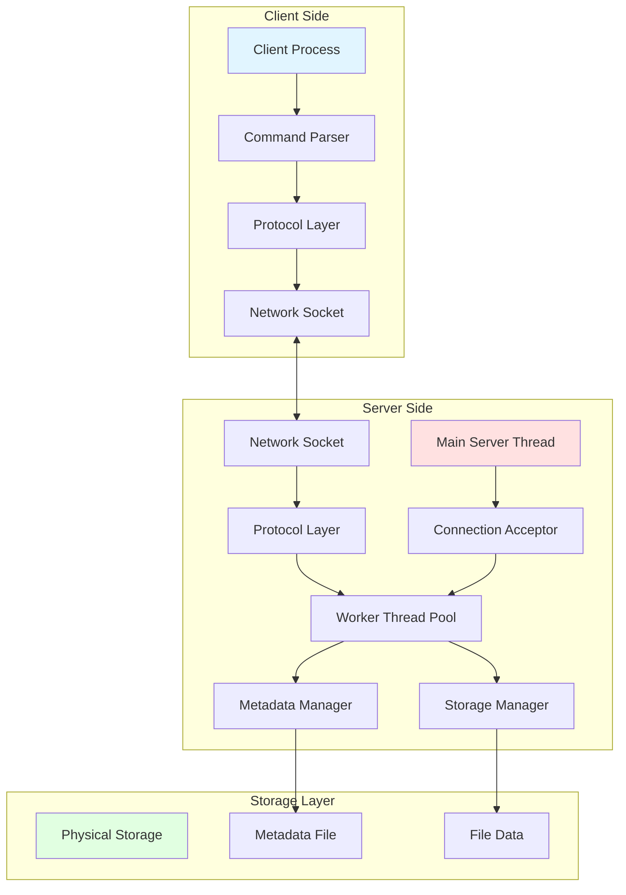
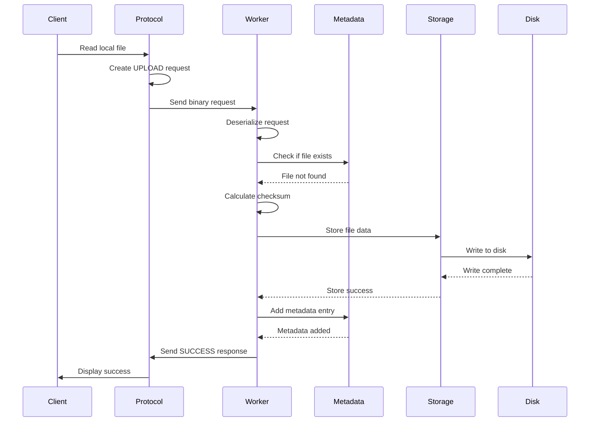
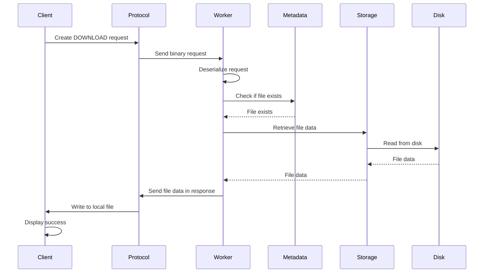
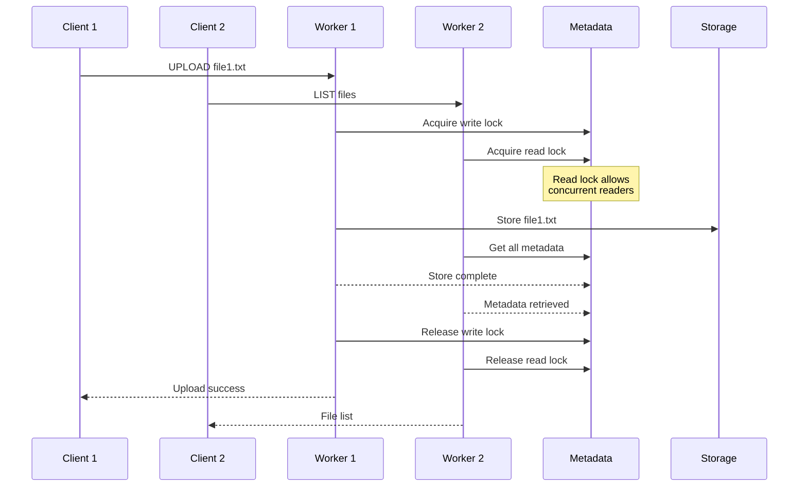
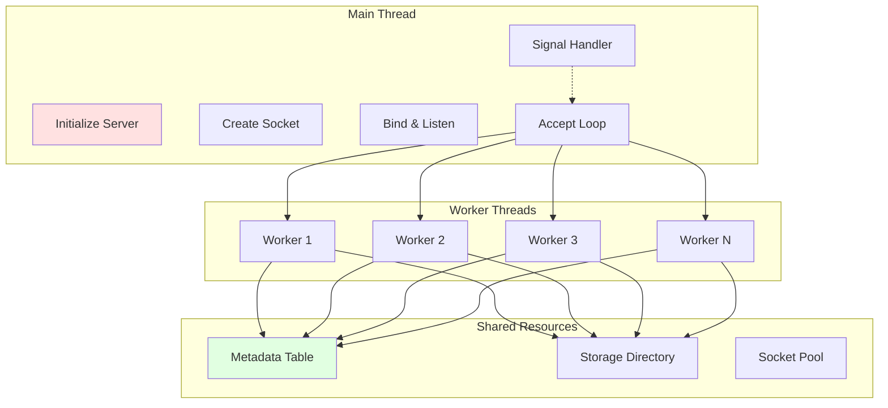
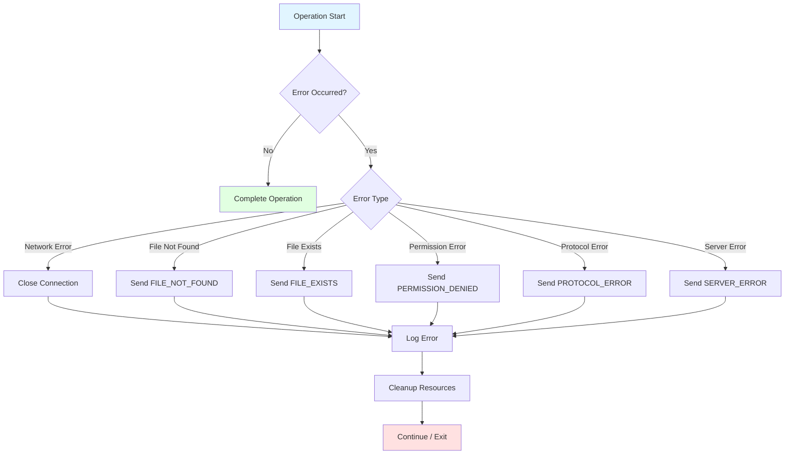
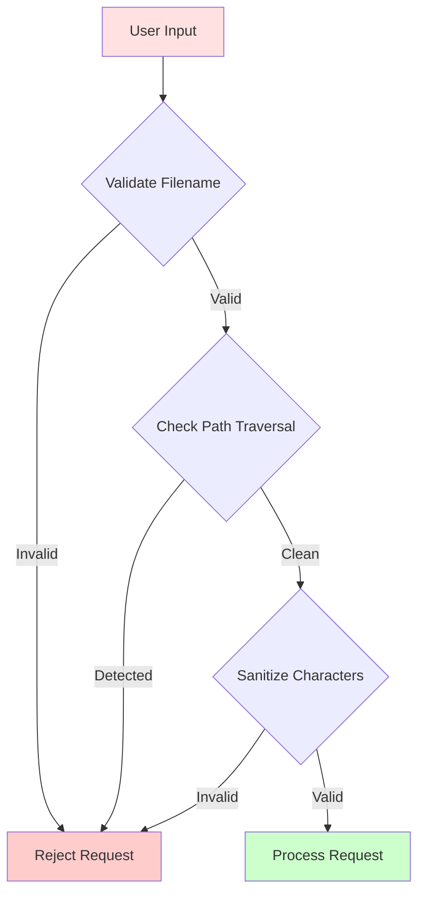

# MiniFS Architecture Documentation

## System Architecture Diagram

## Component Architecture

### Client Components

1. **Main Client Process** (`client.c`)
   - Initializes client context
   - Manages command-line interface
   - Handles user input via readline
   - Coordinates command execution

2. **Command Parser** (`client.c`)
   - Parses user commands
   - Validates command syntax
   - Extracts arguments

3. **Protocol Layer** (`protocol.c`)
   - Serializes requests to binary format
   - Deserializes responses from binary format
   - Handles network byte order conversion

4. **Network Socket**
   - TCP socket connection to server
   - Sends/receives binary data
   - Handles connection errors

### Server Components

1. **Main Server Thread** (`server.c`)
   - Initializes server context
   - Sets up listening socket
   - Handles graceful shutdown
   - Manages worker thread lifecycle

2. **Connection Acceptor** (`server.c`)
   - Accepts incoming client connections
   - Creates worker thread per client
   - Logs connection events

3. **Worker Thread Pool** (`worker.c`)
   - One thread per client connection
   - Processes client requests
   - Executes file operations
   - Sends responses to clients

4. **Metadata Manager** (`metadata.c`)
   - Maintains file metadata table
   - Thread-safe operations with rwlock
   - Persists metadata to disk
   - Validates metadata consistency

5. **Storage Manager** (`storage.c`)
   - Manages physical file storage
   - Handles file I/O operations
   - Thread-safe with mutex
   - Calculates checksums

6. **Protocol Layer** (`protocol.c`)
   - Deserializes client requests
   - Serializes server responses
   - Validates protocol format

## Data Flow

### Upload Flow

### Download Flow

### Concurrent Access Flow

## Thread Model

### Server Thread Architecture

### Thread Synchronization

- **Metadata Table**: Protected by `pthread_rwlock_t`
  - Read operations: Acquire read lock (multiple readers allowed)
  - Write operations: Acquire write lock (exclusive access)
  
- **Storage Directory**: Protected by `pthread_mutex_t`
  - All file operations require exclusive lock
  
- **Worker Thread Pool**: Protected by `pthread_mutex_t`
  - Worker addition/removal requires lock

## Error Handling

### Error Recovery Flow

## Performance Considerations

### Optimization Strategies

1. **Binary Protocol**: Reduces data transfer overhead
2. **Thread Pool**: Reuses worker threads (future enhancement)
3. **Read-Write Locks**: Allows concurrent metadata reads
4. **Buffered I/O**: Uses efficient buffer sizes
5. **Checksum Calculation**: Simple but effective integrity check

### Scalability Limits

- **Maximum Clients**: 100 concurrent worker threads
- **Maximum Files**: 1000 metadata entries
- **File Size**: Limited by available disk space
- **Filename Length**: 255 characters

## Security Architecture

### Input Validation

### Security Measures

1. **Filename Validation**: Prevents path traversal attacks
2. **Character Sanitization**: Removes dangerous characters
3. **Timeout Protection**: 5-minute client timeout
4. **Resource Limits**: Maximum file and client limits
5. **Error Handling**: Graceful error responses

## Future Architecture Enhancements

### Planned Improvements

1. **Thread Pool**: Replace thread-per-client with thread pool
2. **Connection Pooling**: Reuse client connections
3. **Caching Layer**: Add in-memory cache for frequently accessed files
4. **Load Balancing**: Distribute load across multiple servers
5. **Replication**: Multi-server data replication
6. **Authentication**: Add user authentication layer
7. **Encryption**: Implement TLS for secure communication
