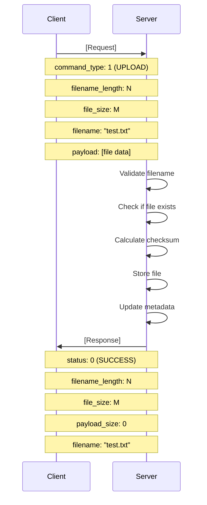
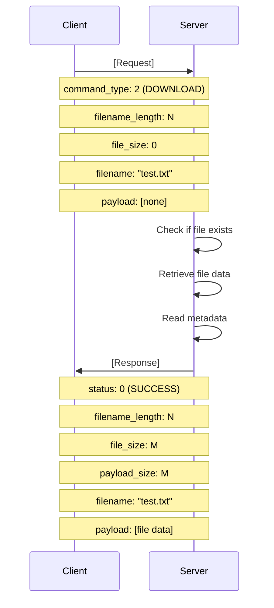
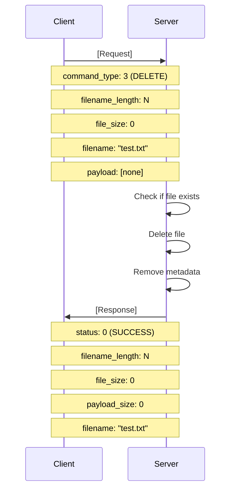
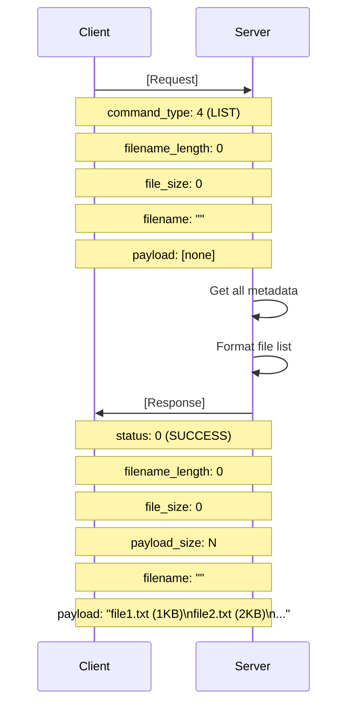
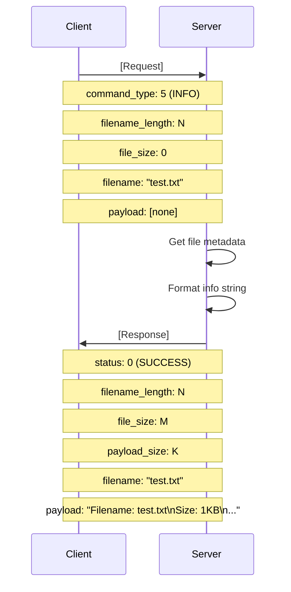

# MiniFS Protocol Documentation

## Protocol Overview

MiniFS uses a custom binary protocol for efficient client-server communication. The protocol is designed to minimize overhead while providing robust error handling and support for various file operations.

## Packet Structure

### Request Packet (Client → Server)

```
Offset  | Size  | Field              | Description
--------|-------|--------------------|---------------------------------
0       | 4     | command_type       | Command type (uint32_t, network order)
4       | 4     | filename_length    | Length of filename (uint32_t, network order)
8       | 8     | file_size          | Size of file in bytes (uint64_t, network order)
16      | N     | filename           | Filename string (null-terminated)
16+N    | M     | payload            | File data (if applicable)
```

**Total Size**: 16 + filename_length + payload_size bytes

### Response Packet (Server → Client)

```
Offset  | Size  | Field              | Description
--------|-------|--------------------|---------------------------------
0       | 4     | status             | Status code (uint32_t, network order)
4       | 4     | filename_length    | Length of filename (uint32_t, network order)
8       | 8     | file_size          | Size of file in bytes (uint64_t, network order)
16      | 4     | payload_size       | Size of payload (uint32_t, network order)
20      | N     | filename           | Filename string (null-terminated)
20+N    | M     | payload            | Response data (if applicable)
```

**Total Size**: 20 + filename_length + payload_size bytes

## Command Types

| Value | Command | Description | Payload Required |
|-------|---------|-------------|------------------|
| 1     | UPLOAD  | Upload a file to server | Yes (file data) |
| 2     | DOWNLOAD| Download a file from server | No |
| 3     | DELETE  | Delete a file from server | No |
| 4     | LIST    | List all files on server | No |
| 5     | INFO    | Get information about a file | No |
| 6     | EXIT    | Exit client session | No |

## Status Codes

| Value | Status | Description |
|-------|--------|-------------|
| 0     | SUCCESS | Operation completed successfully |
| 1     | ERROR | General error occurred |
| 2     | FILE_NOT_FOUND | Requested file does not exist |
| 3     | FILE_EXISTS | File already exists (for upload) |
| 4     | PERMISSION_DENIED | Permission denied |
| 5     | INVALID_COMMAND | Invalid command received |
| 6     | PROTOCOL_ERROR | Protocol parsing error |
| 7     | SERVER_ERROR | Internal server error |

## Protocol Diagrams

### UPLOAD Command Flow



### DOWNLOAD Command Flow



### DELETE Command Flow



### LIST Command Flow



### INFO Command Flow



## Network Byte Order

All multi-byte integer fields are transmitted in network byte order (big-endian):

- `uint32_t` fields: Use `htonl()` / `ntohl()`
- `uint64_t` fields: Use custom `htonll()` / `ntohll()`

### 64-bit Byte Order Conversion

Since standard POSIX doesn't provide `htonll()` / `ntohll()`, we implement them:

```c
static uint64_t htonll(uint64_t value) {
    const int n = 1;
    if (*(char *)&n == 1) {
        /* Little-endian: swap bytes */
        return ((uint64_t)htonl(value & 0xFFFFFFFF) << 32) | htonl(value >> 32);
    } else {
        /* Big-endian: no swap needed */
        return value;
    }
}

static uint64_t ntohll(uint64_t value) {
    const int n = 1;
    if (*(char *)&n == 1) {
        /* Little-endian: swap bytes */
        return ((uint64_t)ntohl(value & 0xFFFFFFFF) << 32) | ntohl(value >> 32);
    } else {
        /* Big-endian: no swap needed */
        return value;
    }
}
```

## Error Handling

### Protocol Errors

If the server encounters a protocol error (invalid format, corrupted data), it returns:

```
status: 6 (PROTOCOL_ERROR)
filename_length: 0
file_size: 0
payload_size: 0
filename: ""
payload: [none]
```

### File Not Found

If a requested file doesn't exist:

```
status: 2 (FILE_NOT_FOUND)
filename_length: N
file_size: 0
payload_size: 0
filename: "requested_file.txt"
payload: [none]
```

### File Already Exists

If uploading a file that already exists:

```
status: 3 (FILE_EXISTS)
filename_length: N
file_size: 0
payload_size: 0
filename: "existing_file.txt"
payload: [none]
```

## Security Considerations

### Filename Validation

Filenames are validated before processing:

- Maximum length: 255 characters
- No path traversal sequences (`..`)
- No absolute paths (`/`)
- Only alphanumeric, underscore, hyphen, and dot characters

### Size Limits

- Maximum filename length: 255 bytes
- Maximum file size: Limited by available disk space
- Maximum payload size: Limited by available memory

## Implementation Notes

### Serialization

The protocol uses the following serialization functions:

- `protocol_serialize_request()`: Converts request packet to binary
- `protocol_deserialize_request()`: Converts binary to request packet
- `protocol_serialize_response()`: Converts response packet to binary
- `protocol_deserialize_response()`: Converts binary to response packet

### Buffer Management

- Buffers are allocated dynamically based on packet size
- Caller is responsible for freeing allocated memory
- Payload data is not copied during deserialization (pointer only)

### Checksum Calculation

A simple checksum is calculated for uploaded files:

```c
uint32_t utils_calculate_checksum(const uint8_t* data, size_t size) {
    uint32_t checksum = 0;
    for (size_t i = 0; i < size; i++) {
        checksum = (checksum << 8) ^ (checksum >> 24);
        checksum += data[i];
    }
    return checksum;
}
```

## Version Compatibility

The protocol includes a version field for future compatibility:

- Current version: 1
- Version field is not currently used but reserved for future extensions
- Servers should reject unsupported protocol versions

## Future Extensions

### Planned Protocol Enhancements

1. **Compression**: Add compression flag and algorithm identifier
2. **Encryption**: Add encryption flag and key exchange
3. **Chunking**: Support for chunked file transfers
4. **Resumable**: Add offset and resume capability
5. **Authentication**: Add authentication token field
6. **Checksum**: Add stronger checksum algorithm (SHA-256)
7. **Metadata**: Extended metadata (permissions, owner, etc.)
8. **Batch Operations**: Support for batch commands
